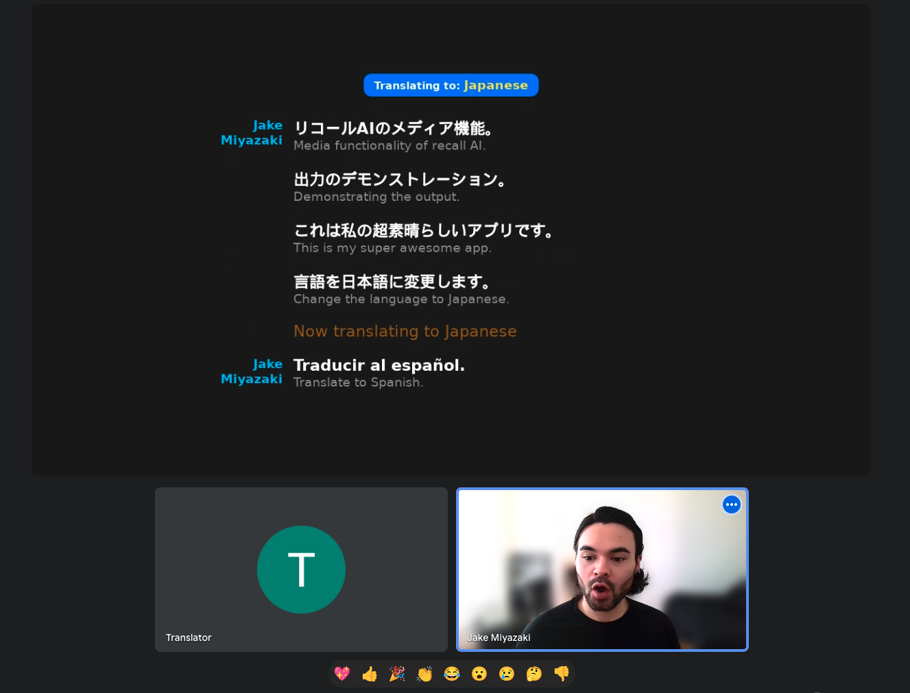

# Real-time Translator Bot



### [Check out a demo here](https://www.loom.com/share/e8294d45653f4e3995bb8fffa5ea74a6?sid=ff65ca58-bf41-4b6a-bd1c-4ab6d39d7e66)

This is a sample app demonstrating how to leverage [Recall.ai](https://www.recall.ai/) to create a real-time notetaker/translator for video conferences.

While this example specifically uses the real-time transcription WebSocket API, you can also use the [Output Media](https://docs.recall.ai/docs/stream-media) feature to receive and output low-latency audio.

## Prerequisites

-   Node.js and npm installed.
-   [Recall.ai](https://recall.ai) API Key
-   [Google Translate API](https://cloud.google.com/translate/docs/reference/rest/?apix=true) Key
-   [ngrok](https://docs.recall.ai/docs/local-webhook-development)

## Setup Guide

1. Clone the Repository

```bash
git clone https://github.com/recallai/real-time-translator-demo.git
cd real-time-translator-demo
```

2. Install Dependencies

```bash
npm install
```

3. Set Up Environment Variables

Clone .env.example and fill out the following environment variables:

```env
VITE_GOOGLE_TRANSLATE_API_KEY=your_google_translate_api_key
```

4. Run the App

Start your ngrok tunnel:

```bash
ngrok http --domain {YOUR_NGROK_STATIC_DOMAIN} 3000
```

Start the react app in another terminal:

```bash
npm run dev
```

This will start the Vite development server and expose your app publicly at your ngrok static domain for the bot to connect to.

5. Start a meeting

For simplicity, we'll use Google Meet, but this also works for other [meeting platforms](https://docs.recall.ai/docs/stream-media#platform-support).

Open a new tab and type `meet.new` to start a new Google Meet call. Copy the link for the next step.

6. Spin up a bot

The last step is to spin up a bot and have it interact with your now-running translator app.

To do this, you can use the following curl command (along with any other desired [parameters](https://docs.recall.ai/reference/bot_create)):

```bash
curl --request POST \
     --url https://{RECALLAI_REGION}.recall.ai/api/v1/bot/ \
     --header 'Authorization: {RECALLAI_API_KEY}' \
     --header 'accept: application/json' \
     --header 'content-type: application/json' \
     --data-raw '
{
  "meeting_url": {MEETING_URL},
  "bot_name": "Translator",
  "output_media": {
    "screenshare": {
      "kind": "webpage",
      "config": {
        "url": {NGROK_TUNNEL_URL}
      }
    }
  },
  "transcription_options": {
    "provider": "meeting_captions"
  }
}'
```

Where:

-   {RECALLAI_REGION} is your Recall.ai API [Region](https://docs.recall.ai/docs/regions).
-   {RECALLAI_API_KEY} is your Recall.ai API key.
-   {MEETING_URL} is the Meeting URL created in step 5.
-   {NGROK_TUNNEL_URL} is your publicly exposed ngrok tunnel URL

The bot will then join your meeting and render the app in the call, transcribing and translating speech in real-time, with appropriate speaker labels.

Happy building!
